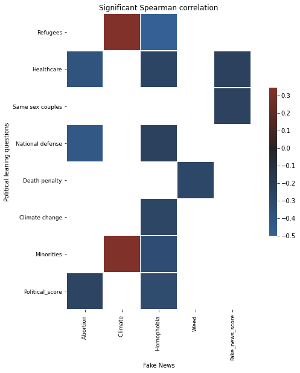
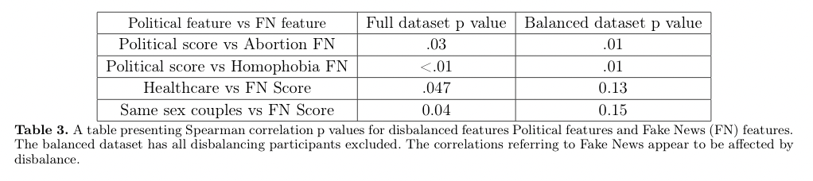
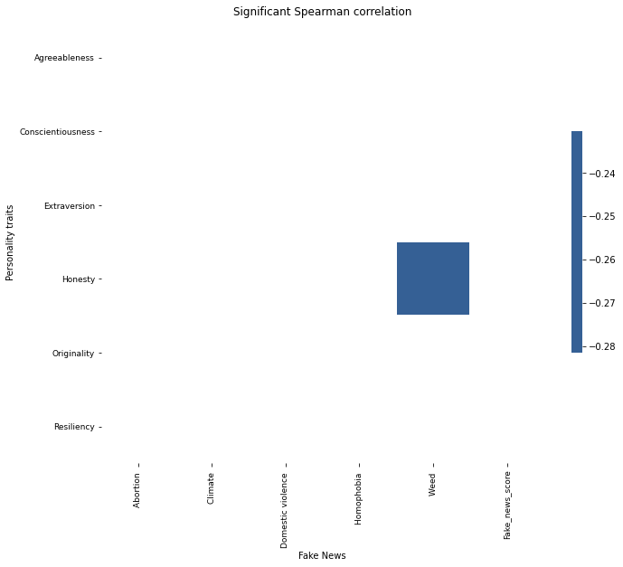
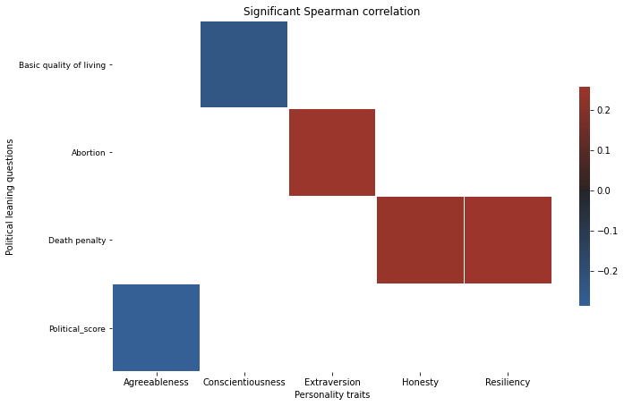
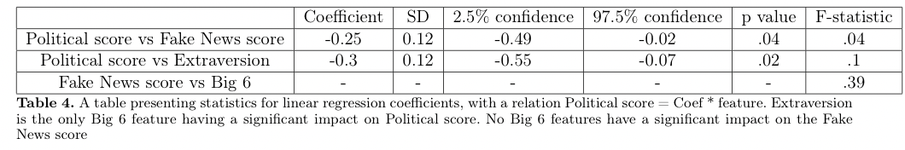
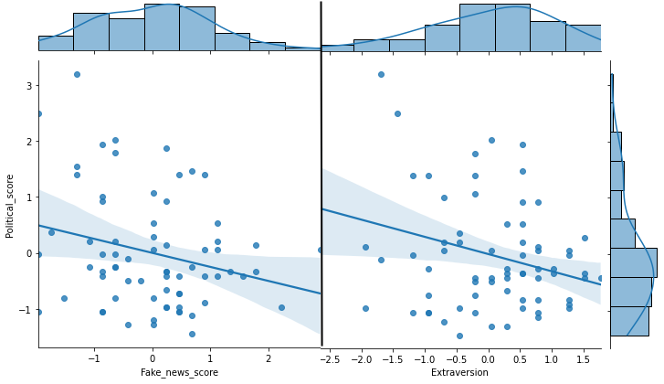

# Fake News Detection

## Abstract

The fake news (FN) spreading always has been a problem for those who want to see the world as it is avoiding other people’s ignorance. 
For some people, though, it is but an opportunity to manipulate the others. Given the current pandemic, one can easily find plenty of examples. 
For instance, vaccine hesitancy in the USA or sky-high increase of ginger’s price in Russia due to the belief that it prevents coronavirus disease, 
or, once again, ideological and political manipulations before elections in the USA. 
These events emphasize the importance and relevance of the problem studied.

This work discusses the relationship between Fake news detection performance, Personality traits, and Political leaning. 
We have studied a sample of mostly undergraduate young people with Liberal to Centrist political views. In this study, 
we found that for this subgroup Personality traits do not impact Fake News detection performance, in contrast to Political Leaning, 
for which Liberals resolve fakes better than Centrists. The relations between Political leaning and Personality traits were found only 
for Agreeableness and Extraversion. The presence of relation for Agreeableness was already shown in the previous articles, whereas for 
Extraversion we suggest that the relation might be present due to a confounding factor, namely that Extraverts and Liberals consume news 
from more sources than the others.

## Results

### Spearman rank correlations
#### Political leaning vs Fake News

For Political Leaning, we considered correlations between answers on all the Political Leaning
questions and all the pieces of news Fake detection performance. 
All significant correlations (P<.05) are presented are presented in Fig. 6.

<figure>
  
  <figcaption>Fig. 6. Spearman rank correlations between answers on Political leaning questions and performance of different Fake News detection.</figcaption>
</figure>

We do not see a significant correlation between overall Political leaning and overall Fake News score. However, we find a lot of 
correlations between specific topics of Political leaning and specific Fake News.  Moreover, we find significant correlation for 
two Political leaning features with overall Fake News score and for two specific Fake News scores with overall Political leaning.

Yet specific features concerned in these correlations appear to have mostly disbalanced distribution, since most of participants voted for one border value. 
To test whether significance is caused by disbalance we excluded people answered border values and estimated correlations again (Tab. 3). 
For balanced dataset both overall Fake news score-related correlations became insignificant, therefore we can conclude that they are due to disbalance, 
rather than natural impact of specific political leaning aspects.
1022  x  228
<figure>
  <figtitle>Original image and decoder fit result</figtitle>
  
</figure>

#### Personality traits vs Fake News
There is only one Personality trait significantly (P=.03) correlating with only one Fake News piece detection (Fig. 7).

<figure>
  
  <figcaption>Fig. 7. Significant correlations between personality traits and Fake News performance detection. Only one significant correlation is present.</figcaption>
</figure>

#### Personality traits vs Political leaning

In this section, we got several significant and logically sensible correlations
For instance, extroverts empathize more to mothers who don’t want to have a child, hence extroverts approve abortion.

<figure>
  
  <figcaption>Fig. 8.Significant correlations between personality traits and answers and political leaning questions. 
  A positive answer to the question means that person approves the given act. 
  A positive political score means the person lean towards the centrist, rather than the left. Only one significant correlation is present.</figcaption>
</figure>

### Linear regressions

In this part data on all features were normalized to have M=0, SD=1. All figures and Tables have same scales. 
Since linear coefficients vary near zero and we are interested in their signs (positive or negative), 
we consider 95% confidence intervals to be sure in the sign.

<figure>
  <figtitle>Statistics for significant linear coefficients</figtitle>
  
</figure>

<figure>
  <figtitle>Scatter plots for Significant linear relations</figtitle>
  
  <figcaption>Fig. 9.
Scatterplots showing the relation between Political Leaning score, 
Fake News score and the only significant for linear regression Big 6 feature - extraversion
</figcaption>
</figure>

## Discussion
### Personality traits vs Fake News

In this section the hypothesis was “Originality and Resiliency are positively related to the ability to detect fake news”. 
However, in practice, no strong correlation for either Originality (P=.31 for Spearman correlation and P=.5 for Linear regression) 
or Resiliency (P=.66 for Spearman correlation and P=.9 for Linear regression) were found. None of Big 6 features showed significance 
in either correlation or linear impact. Therefore, we can conclude that on the given data we find our first hypothesis disproved. Moreover, 
we can suggest that Personality traits may not affect Fake News detection at all. Our hypothesis was drawn from a diverse political spectrum 
research whereas our sample of participants has political views from liberal to centrists (M=0.2, SD=0.14 with 0 for Liberal and 1 for Conservative), 
moreover, average age was 22.23 years (SD=5.64). The fact that our sample was disbalanced in these features implies that our results may be applied 
only on these people subclasses, yet they can’t be certainly extrapolated on any given sample of people.

### Political leaning vs Fake News
In this section out hypothesis was “Fake news detection capabilities are not influenced by (moderate) political leaning”.
 However, using method based on linear regression we significantly (P=.04) find that Liberals are better in resolving Fake News 
 then Centrists (M=-0.25, SD=0.12, Tab. 4, Fig. 9). Sindermann et al. 2020 showed that Right-Wing Authoritarianism is associated with 
 selective interest in information fitting with one’s attitudes. From our results, we may conclude that this effect may propagate on centrists 
 resulting in worse performance in Fake News detection. On the other hand, in same article, there was small evidence on the fact that liberals tend 
 to consume a higher number of news sources. It may improve their ability to resolve Fake News due to considering information coming from different sources. 
 Both of these explanations may work as they coincide with the findings of our study.
 
 ### Personality traits vs Fake News

In this section the hypothesis was drawn from Chirumbolo and Leone 2010, namely “Conscientiousness, agreeableness, and originality are typically found 
to predict political criteria”. Unlikely, analysis of Spearman correlations confirmed only agreeableness to predict political criteria (R=-0.28, P=.02). 
The other method rejects this hypothesis altogether. The analysis of linear regression has shown only Extraversion to be a predictive factor for Political 
leaning (M=-0.3, SD=0.12, P=.02 for linear coefficient). In the article Gerber et al. 2011 it was shown that extraverts are likely to report that they are 
interested in politics, watching political talk shows and network news. In a turn, Sindermann et al. 2020 showed a small evidence on the fact that liberals 
tend to consume a higher number of news sources. From this, we conclude that for Extraversion and Political leaning number of news usually consumed is a 
correlating trait and may work as a confounding factor for relation between these features. In following work, given more data the information may be propagated 
through correlating features in order to reduce the confounding variables for considered features.

## Conclusion

In this work, we have studied a sample of mostly undergraduate young people with Liberal to Centrist political views. 
We found that for this subgroup Personality traits do not impact Fake News detection performance, in contrast to Political Leaning, 
for which Liberals resolve fakes better than Centrists. The relations between Political leaning and Personality traits were found only 
for Agreeableness and Extraversion. The presence of relation for Agreeableness was already shown in previous articles, whereas for Extraversion 
we suggest this relation might be present due to a confounding factor, namely that Extraverts and Liberals consume news from more sources than the others. 

The findings of this research may help social networks to understand how susceptible to fake news their audience is. Given this data, 
social networks will gain possibility to distribute resources of news validation more efficiently. Moreover, during election campaigns, 
it is always important to understand the electorate’s susceptibility to unconfirmed statements to build a sensitive strategy of opposing accusations 
of the other political side and creating their announcements. 

We also find that the correlation is present between performance of detection specific topics and specific Political related questions 
or specific Personality traits. The findings seem sensible however, they need to be tested on a higher number of Fake News questions and a 
more vast sample of participants. Furthermore, variety of age, education level, and political leaning should also be extended to validate 
possibility to extrapolate results found in this study on a more general sample of participants.

## Contributors ✨

<table>
  <tr>
    <td align="center"><a href="https://github.com/egorssed"> <b>Egor Danilov</b></a> <a href="https://github.com/egorssed" title="Github">💻</a></td>
    <td align="center"><a href="https://github.com/miloo42"> <b>Milo Imbeni</b></a> <a href="https://github.com/miloo42" title="Github">💻</a></td>
    <td align="center"><a href="https://github.com/riccardofradiani"> <b>Riccardo Fradiani</b></a> <a href="https://github.com/riccardofradiani" title="Github">💻</a></td>
  </tr>
</table>

And others.
